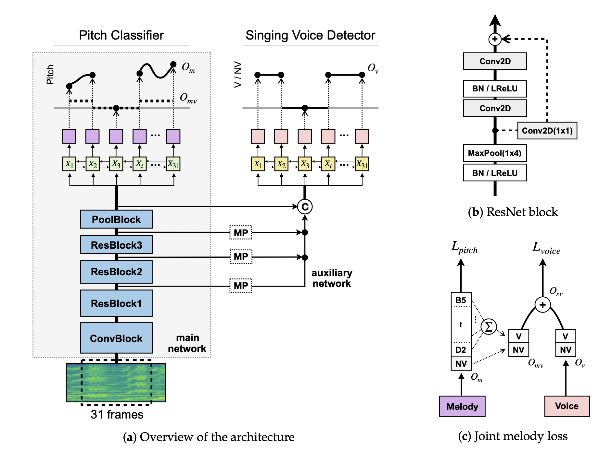

# JDCNet-pytorch

This is a [PyTorch](https://pytorch.org/) re-implementation of 
Kum et al. - "Joint Detection and Classification of 
Singing Voice Melody Using Convolutional Recurrent Neural Networks" (2019).
The proposed neural network model will be called **JDCNet** for convenience.

- **paper**: [PDF](https://www.mdpi.com/2076-3417/9/7/1324)
- **original Keras implementation**: [melodyExtraction_JDC](https://github.com/keums/melodyExtraction_JDC)

This is an attempt of implementing JDCNet as close as possible with the original paper.
Any ambiguities in implementation details have been filled in by my own decisions,
which account for any differences with the original author's implementation details.

## Prerequisites

Major dependencies for this project are:

- python >= 3.6
- pytorch >= 1.2
- librosa >= 0.7.0
- pytorch-land == 0.1.6 (train only)

Any other required libraries are written in `requirements.txt`.

This project also uses a mini library called [pytorch-land](https://github.com/dansuh17/pytorch-land) 
created by myself that implements a general `Trainer` for pytorch based models.
It provides easy logging, native tensorboard support, 
and performs basic "train-validate-test" training sequence.

[librosa](https://librosa.github.io/librosa/) is used for reading audio files.

# JDCNet

JDCNet is a singing voice melody detection and classification network.
It detects detection of whether there exists a noticeable singing voice in a certain frame, 
and, if exists, classifies the pitch of the sung note.

The pitch classification is done using a convolutional network with a bidirectional LSTM (BiLSTM) module attached at the end.
Intermediate features for pitch classifier are utilized by the auxiliary detector network, 
also a BiLSTM module, to aid the determination of voice existence.

The input is a log-magnitude spectrogram chunk that consists of 31 frames and 513 frequency bins.

The model predicts whether or not the voice exists for each frame, giving a `(31 x 2)` tensor output,
and classifies the pitch into one of 722 classes that represent 721 different frequencies 
evenly distributed (in log scale) from notes D3 (MIDI=38) to B5 (MIDI=83) inclusive,
and an extra 'non-voice' class.



# Data Preprocess

[MedleyDB's Melody Subset](https://zenodo.org/record/2628782#.XcvOPpIzZ24) 
dataset is used to train this model.
Acquire the dataset, extract the contents, and run the preprocessing script 
to be ready for training.

```shell
./medleydb_preprocess.py --in_root <medleydb_root> --out_root <output_root> --metadata_path <path>/<to>/<metadata_file>.json
```

# Train

You must provide a configuration file to train the network. 
Default configuration file with default parameters are provided as `default_config.json`.
In order to start training, run the script `train.py`.

```shell
./train.py --config <your_config>.json
```

# Singing voice melody extraction

You can generate a MIDI file containing singing voice melody 

```shell
./extract_melody.py --model ./<path>/<to>/<model>.pth --input_audio <input_audio>.wav
```
